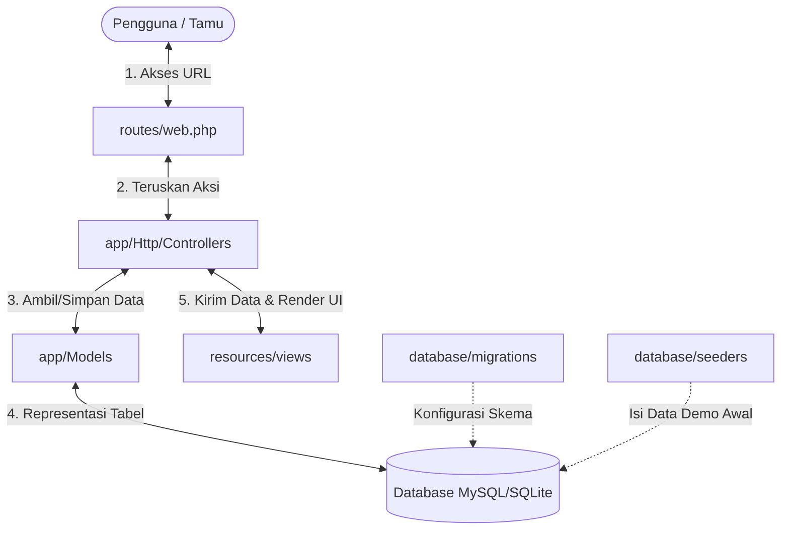

# 📚 PENJELASAN STRUKTUR PROYEK (MVC LARAVEL)
## Sistem Manajemen SPPG (Sistem Peningkatan Gizi)

Dokumen ini berisi panduan dan penjelasan komprehensif mengenai struktur file proyek **Sistem Peningkatan Gizi (SPPG)**. Penjelasan ini dikelompokkan berdasarkan lima folder utama yang mengontrol jalannya logika aplikasi: **Models**, **Migrations**, **Seeders**, **Views**, dan **Routes**.

---

## 🗺️ Peta Aliran Data Arsitektur Sistem (MVC)

Berikut adalah visualisasi sederhana bagaimana setiap bagian saling terhubung:



---

## 📂 1. Models (`app/Models`)
Di dalam pola arsitektur **MVC**, **Model** bertanggung jawab untuk berinteraksi langsung dengan database, merepresentasikan tabel-tabel data, serta mendefinisikan hubungan (relasi) antar tabel tersebut.

| Nama File | Target Tabel | Fungsi Utama & Relasi |
| :--- | :--- | :--- |
| **[BahanMakanan.php](file:///c:/tugas%20sekolah/tugas%20kelompok%20akhir%20semester/manajemen-sppg/app/Models/BahanMakanan.php)** | `bahan_makanan` | Mengelola data master bahan mentah makanan (seperti Beras, Daging Sapi, Susu). Menyimpan kandungan gizi per satuan (`kalori`, `protein`, `karbohidrat`, `lemak`). Memiliki relasi *HasMany* ke `StokBahan`. |
| **[Distribusi.php](file:///c:/tugas%20sekolah/tugas%20kelompok%20akhir%20semester/manajemen-sppg/app/Models/Distribusi.php)** | `distribusi` | Log transaksi real-time penyaluran makanan gizi kepada siswa. Menyimpan status penerimaan, catatan, dan waktu distribusi. Terhubung (*BelongsTo*) ke `PenerimaManfaat` (siswa), `JadwalDistribusi`, dan `Pengguna` (petugas). |
| **[Institusi.php](file:///c:/tugas%20sekolah/tugas%20kelompok%20akhir%20semester/manajemen-sppg/app/Models/Institusi.php)** | `institusi` | Mengelola data instansi sasaran program (misalnya SD Marhas, SMP Marhas, SMK Marhas). Memiliki relasi *HasMany* ke siswa (`PenerimaManfaat`) dan pegawai (`Pengguna`). |
| **[JadwalDistribusi.php](file:///c:/tugas%20sekolah/tugas%20kelompok%20akhir%20semester/manajemen-sppg/app/Models/JadwalDistribusi.php)** | `jadwal_distribusi` | Mengatur penjadwalan pembagian makanan di sekolah-sekolah terkait. Menyimpan lokasi, jam mulai/selesai, dan status keaktifan jadwal. Terhubung ke `MenuGizi` dan log `Distribusi`. |
| **[MenuGizi.php](file:///c:/tugas%20sekolah/tugas%20kelompok%20akhir%20semester/manajemen-sppg/app/Models/MenuGizi.php)** | `menu_gizi` | Menyimpan paket makanan bergizi yang disusun oleh Ahli Gizi. Mengakumulasikan total kandungan zat gizi, status persetujuan Kepala SPPG (menunggu/disetujui/ditolak), serta catatan penolakan jika ada. |
| **[PenerimaManfaat.php](file:///c:/tugas%20sekolah/tugas%20kelompok%20akhir%20semester/manajemen-sppg/app/Models/PenerimaManfaat.php)** | `penerima_manfaat` | Menyimpan data profil siswa penerima bantuan makanan bergizi (NIK, NISN, nama, PIN keamanan konfirmasi, status aktif). Terhubung ke sekolah asal (`Institusi`). |
| **[Pengguna.php](file:///c:/tugas%20sekolah/tugas%20kelompok%20akhir%20semester/manajemen-sppg/app/Models/Pengguna.php)** | `pengguna` | Model utama otentikasi (User/Pegawai). Berisi username, email, password terenkripsi, status aktif, dan foto profil. Terhubung ke `Peran` (Role) dan `Institusi`. |
| **[Peran.php](file:///c:/tugas%20sekolah/tugas%20kelompok%20akhir%20semester/manajemen-sppg/app/Models/Peran.php)** | `peran` | Menyimpan daftar hak akses (*Role-Based Access Control*). Peran sistem terdiri dari: *Kepala SPPG, Ahli Gizi, Petugas,* dan *Penerima Manfaat*. |
| **[StokBahan.php](file:///c:/tugas%20sekolah/tugas%20kelompok%20akhir%20semester/manajemen-sppg/app/Models/StokBahan.php)** | `stok_bahan` | Melacak jumlah stok aktual dan stok minimum di gudang logistik. Memiliki method dinamis `getIsKritisAttribute()` untuk mendeteksi secara instan jika persediaan bahan pangan menipis demi memicu alert otomatis di dashboard. |

---

## 📂 2. Migrations (`database/migrations`)
**Migration** bertindak sebagai pengontrol versi untuk database. File-file ini mendefinisikan skema struktur tabel database agar dapat diproduksi secara identik di komputer mana pun proyek dijalankan.

### ⚙️ Sistem Bawaan (Laravel Core)
* 📄 **[0001_01_01_000000_create_users_table.php](file:///c:/tugas%20sekolah/tugas%20kelompok%20akhir%20semester/manajemen-sppg/database/migrations/0001_01_01_000000_create_users_table.php)** — Tabel otentikasi dasar Laravel (tidak digunakan langsung karena kita memakai tabel kustom `pengguna`).
* 📄 **[0001_01_01_000001_create_cache_table.php](file:///c:/tugas%20sekolah/tugas%20kelompok%20akhir%20semester/manajemen-sppg/database/migrations/0001_01_01_000001_create_cache_table.php)** — Menyimpan temporary cache untuk performa aplikasi.
* 📄 **[0001_01_01_000002_create_jobs_table.php](file:///c:/tugas%20sekolah/tugas%20kelompok%20akhir%20semester/manajemen-sppg/database/migrations/0001_01_01_000002_create_jobs_table.php)** — Menangani proses antrean tugas di latar belakang (*queue processing*).

### 🛠️ Skema Tabel Sistem SPPG (Kustom)
1. 📄 **[2026_05_17_000001_create_peran_table.php](file:///c:/tugas%20sekolah/tugas%20kelompok%20akhir%20semester/manajemen-sppg/database/migrations/2026_05_17_000001_create_peran_table.php)** — Membuat tabel peran (`peran`) untuk menampung jenis level akses user.
2. 📄 **[2026_05_17_000002_create_institusi_table.php](file:///c:/tugas%20sekolah/tugas%20kelompok%20akhir%20semester/manajemen-sppg/database/migrations/2026_05_17_000002_create_institusi_table.php)** — Menyusun tabel `institusi` untuk sekolah/mitra SPPG.
3. 📄 **[2026_05_17_000003_create_pengguna_table.php](file:///c:/tugas%20sekolah/tugas%20kelompok%20akhir%20semester/manajemen-sppg/database/migrations/2026_05_17_000003_create_pengguna_table.php)** — Menyusun tabel `pengguna` lengkap dengan constraint foreign key ke tabel `peran` dan `institusi`.
4. 📄 **[2026_05_17_000004_create_penerima_manfaat_table.php](file:///c:/tugas%20sekolah/tugas%20kelompok%20akhir%20semester/manajemen-sppg/database/migrations/2026_05_17_000004_create_penerima_manfaat_table.php)** — Menyusun skema penerima gizi (kode penerima unik, NIK, NISN, PIN konfirmasi, alamat, dll).
5. 📄 **[2026_05_17_000005_create_menu_gizi_table.php](file:///c:/tugas%20sekolah/tugas%20kelompok%20akhir%20semester/manajemen-sppg/database/migrations/2026_05_17_000005_create_menu_gizi_table.php)** — Mengatur struktur penyimpanan menu gizi (total zat gizi mikro/makro, status draf, persetujuan).
6. 📄 **[2026_05_17_000006_create_jadwal_distribusi_table.php](file:///c:/tugas%20sekolah/tugas%20kelompok%20akhir%20semester/manajemen-sppg/database/migrations/2026_05_17_000006_create_jadwal_distribusi_table.php)** — Membuat tabel penjadwalan penyaluran logistik bergizi di lokasi sekolah.
7. 📄 **[2026_05_17_000007_create_distribusi_table.php](file:///c:/tugas%20sekolah/tugas%20kelompok%20akhir%20semester/manajemen-sppg/database/migrations/2026_05_17_000007_create_distribusi_table.php)** — Menyusun tabel relasional log transaksi penyaluran pangan kepada penerima.
8. 📄 **[2026_05_17_000008_create_bahan_makanan_table.php](file:///c:/tugas%20sekolah/tugas%20kelompok%20akhir%20semester/manajemen-sppg/database/migrations/2026_05_17_000008_create_bahan_makanan_table.php)** — Membuat tabel nama bahan mentah berserta satuan takarannya (Kg, Kotak, dll).
9. 📄 **[2026_05_17_000009_create_stok_bahan_table.php](file:///c:/tugas%20sekolah/tugas%20kelompok%20akhir%20semester/manajemen-sppg/database/migrations/2026_05_17_000009_create_stok_bahan_table.php)** — Mengonfigurasi tabel inventarisasi kuantitas stok aktual serta ambang minimum keamanan pangan.
10. 📄 **[2026_05_17_000010_add_foto_profil_to_pengguna_table.php](file:///c:/tugas%20sekolah/tugas%20kelompok%20akhir%20semester/manajemen-sppg/database/migrations/2026_05_17_000010_add_foto_profil_to_pengguna_table.php)** — File migrasi tambahan kustom untuk memperluas tabel `pengguna` agar mendukung unggahan gambar foto profil.

---

## 📂 3. Seeders (`database/seeders`)
**Seeder** bertugas untuk mengisi database kosong Anda dengan data awal (dummy/simulasi) agar program dapat langsung diuji dan didemonstrasikan dengan skenario nyata.

* 📄 **[DatabaseSeeder.php](file:///c:/tugas%20sekolah/tugas%20kelompok%20akhir%20semester/manajemen-sppg/database/seeders/DatabaseSeeder.php)**
  Merupakan file seeder tunggal yang mengeksekusi inisialisasi data penting berikut:
  1. **Hak Akses:** Mendaftarkan peran (1) Kepala SPPG, (2) Ahli Gizi, (3) Petugas, dan (4) Penerima Manfaat.
  2. **Sekolah Sasaran:** Mendaftarkan SD Marhas, SMP Marhas, dan SMK Marhas sebagai institusi percontohan.
  3. **Aktor Utama Sistem (Password default: `akses123`):**
     * **`kepala sppg`** ➔ Dr. Ratna (Kepala SPPG yang menyetujui menu gizi & mengelola akun).
     * **`ahligizi`** ➔ Buk Fitri (Ahli Gizi yang menyusun menu diet sehat berkalori tinggi).
     * **`petugasdaftar`** ➔ Pa Ramdani (Petugas admin pendaftaran siswa penerima manfaat).
     * **`petugasgudang`** ➔ Pak Taufik (Petugas logistik yang melacak keluar masuk bahan mentah).
     * **`petugasdistribusi`** ➔ Kang Asep (Petugas lapangan pembagi pangan bermodalkan pemindai QR).
  4. **Stok Logistik Awal:** Mengisi Beras, Sop, Susu, dan Daging Sapi (stok daging sengaja diset di bawah stok minimum agar memicu status merah/kritis di dashboard).
  5. **Menu & Distribusi:** Membuat contoh menu "Paket Sehat Cerdas (Daging)", membuat jadwal pembagian harian, serta mencatatkan transaksi distribusi percontohan yang berhasil diterima siswa.

---

## 📂 4. Views (`resources/views`)
**View** memuat berkas-berkas antarmuka pengguna (UI) aplikasi yang ditulis menggunakan template engine bawaan Laravel, yaitu **Blade**. 

### 🌐 Halaman Utama & Template Dasar
* 📄 **[landing.blade.php](file:///c:/tugas%20sekolah/tugas%20kelompok%20akhir%20semester/manajemen-sppg/resources/views/landing.blade.php)** — Halaman beranda publik. Berisi form pelacakan jadwal pembagian makanan, verifikasi penerima gizi, serta fitur integrasi pemindaian QR code kamera.
* 📄 **[welcome.blade.php](file:///c:/tugas%20sekolah/tugas%20kelompok%20akhir%20semester/manajemen-sppg/resources/views/welcome.blade.php)** — Berkas default Laravel (halaman dokumentasi standar).
* 📄 **[layouts/app.blade.php](file:///c:/tugas%20sekolah/tugas%20kelompok%20akhir%20semester/manajemen-sppg/resources/views/layouts/app.blade.php)** — Struktur layout induk. Mengatur navigasi bar atas, sidebar dinamis yang otomatis menyesuaikan menu berdasarkan peran user yang masuk, serta impor Bootstrap dan Javascript.

### 🔐 Modul Otentikasi
* 📄 **[auth/login.blade.php](file:///c:/tugas%20sekolah/tugas%20kelompok%20akhir%20semester/manajemen-sppg/resources/views/auth/login.blade.php)** — Form login responsif bagi pegawai SPPG (Dr. Ratna, Buk Fitri, Kang Asep, dll).
* 📄 **[auth/login_app.blade.php](file:///c:/tugas%20sekolah/tugas%20kelompok%20akhir%20semester/manajemen-sppg/resources/views/auth/login_app.blade.php)** — Desain login sekunder / khusus.

### 📊 Dashboard Utama
* 📄 **[dashboard/index.blade.php](file:///c:/tugas%20sekolah/tugas%20kelompok%20akhir%20semester/manajemen-sppg/resources/views/dashboard/index.blade.php)** — Pusat kontrol pasca-login. Menampilkan bagan statistik konsumsi zat gizi rata-rata (Ahli Gizi/Kepala) atau menampilkan notifikasi stok logistik menipis, jumlah porsi tersalurkan hari ini, serta log aktivitas penyaluran teranyar (Petugas/Kepala).

### ⚙️ Modul-Modul CRUD Fitur Aplikasi
* 📂 **[akun/](file:///c:/tugas%20sekolah/tugas%20kelompok%20akhir%20semester/manajemen-sppg/resources/views/akun)** (`index.blade.php`, `form.blade.php`)
  Antarmuka khusus Kepala SPPG untuk melakukan registrasi akun pegawai baru, mengedit data staf, atau menonaktifkan status aktif pegawai yang resign.
* 📂 **[penerima/](file:///c:/tugas%20sekolah/tugas%20kelompok%20akhir%20semester/manajemen-sppg/resources/views/penerima)** (`index.blade.php`, `create.blade.php`, `edit.blade.php`)
  Kelola pendaftaran siswa penerima manfaat baru, mencetak QR Code kartu penerima secara langsung, serta memperbarui biodata.
* 📂 **[menu/](file:///c:/tugas%20sekolah/tugas%20kelompok%20akhir%20semester/manajemen-sppg/resources/views/menu)** (`index.blade.php`, `create.blade.php`, `edit.blade.php`)
  Modul formulir penyusunan gizi (perhitungan kalori, protein, lemak, karbo) bagi Ahli Gizi, dilengkapi tombol persetujuan cepat bagi Kepala SPPG.
* 📂 **[distribusi/](file:///c:/tugas%20sekolah/tugas%20kelompok%20akhir%20semester/manajemen-sppg/resources/views/distribusi)** (`index.blade.php`, `riwayat.blade.php`, `scan.blade.php`)
  Halaman pemindaian QR code siswa oleh petugas pembagi makanan di sekolah, modal input verifikasi PIN siswa, dan melihat rekapitulasi riwayat pembagian harian.
* 📂 **[logistik/](file:///c:/tugas%20sekolah/tugas%20kelompok%20akhir%20semester/manajemen-sppg/resources/views/logistik)** (`index.blade.php`, `form.blade.php`, `master_bahan.blade.php`)
  Kelola keluar masuk pasokan stok logistik bahan pangan mentah dan pendataan master bahan makanan baru di gudang penyimpanan.
* 📂 **[profil/](file:///c:/tugas%20sekolah/tugas%20kelompok%20akhir%20semester/manajemen-sppg/resources/views/profil)** (`index.blade.php`)
  Halaman bagi pegawai yang sedang aktif masuk untuk merubah sandi login mereka, memperbarui email, dan mengganti foto profil pribadi.

---

## 📂 5. Routes (`routes`)
**Routes** mendefinisikan peta navigasi aplikasi (endpoint URL) yang menghubungkan request pengguna menuju fungsi pengendali di Controller yang sesuai.

* 📄 **[web.php](file:///c:/tugas%20sekolah/tugas%20kelompok%20akhir%20semester/manajemen-sppg/routes/web.php)**
  Merupakan pengendali rute utama aplikasi web SPPG. Berikut adalah daftar endpoint penting yang diatur:
  * `Route::get('/', [LandingPageController::class, 'index'])` ➔ Halaman landing publik.
  * `/login` & `/logout` ➔ Rute otentikasi login admin/staf.
  * `/dashboard` ➔ Dashboard dinamis multi-role.
  * **Prefix `/penerima`** ➔ Kumpulan rute kelola data penerima manfaat (Siswa).
  * **Prefix `/menu`** ➔ Kumpulan rute perancangan menu dan persetujuan Kepala SPPG.
  * **Prefix `/distribusi`** ➔ Kumpulan rute operasional penyaluran, scan QR, konfirmasi PIN, dan riwayat.
  * **Prefix `/logistik`** ➔ Kumpulan rute input pasokan logistik dan master bahan pangan mentah.
  * **Prefix `/akun`** ➔ Kumpulan rute manajemen akun staf oleh Kepala SPPG.
  * **Prefix `/profil`** ➔ Rute pembaruan profil pengguna pribadi.

* 📄 **[console.php](file:///c:/tugas%20sekolah/tugas%20kelompok%20akhir%20semester/manajemen-sppg/routes/console.php)**
  Menyimpan perintah konsol (*Command Line Artisan*) kustom yang bisa dijalankan langsung lewat Command Prompt / Terminal.

---

## 💡 Panduan Cepat Perintah Artisan Terkait
Untuk melakukan uji coba struktur database di atas, Anda dapat menggunakan perintah terminal berikut:

* **Membangun Ulang Struktur database beserta data demonya dari awal:**
  ```bash
  php artisan migrate:fresh --seed
  ```
* **Menjalankan Server Lokal Aplikasi:**
  ```bash
  php artisan serve
  ```

---
*Dokumentasi ini disusun khusus untuk membantu pengerjaan Tugas Kelompok Akhir Semester SPPG.*
